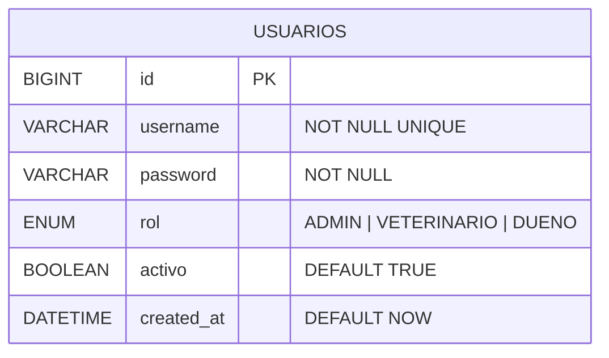
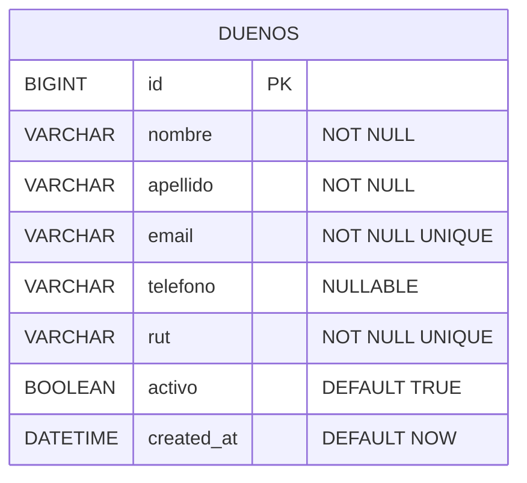
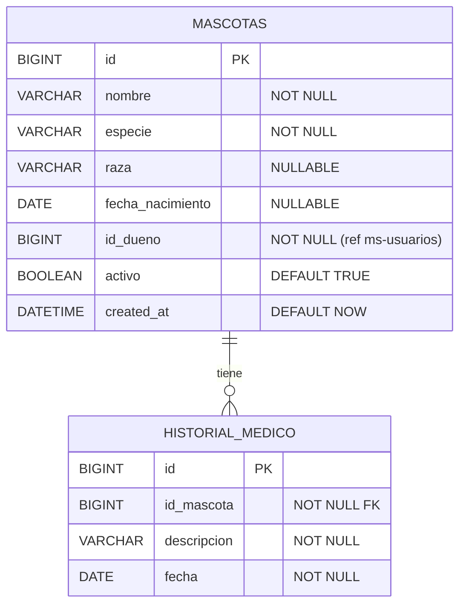
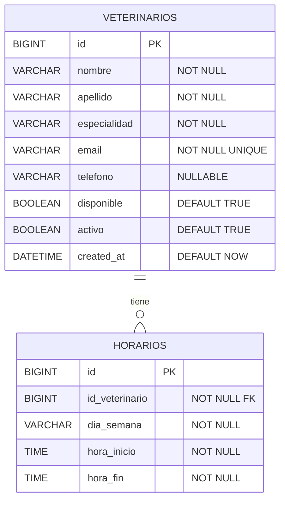
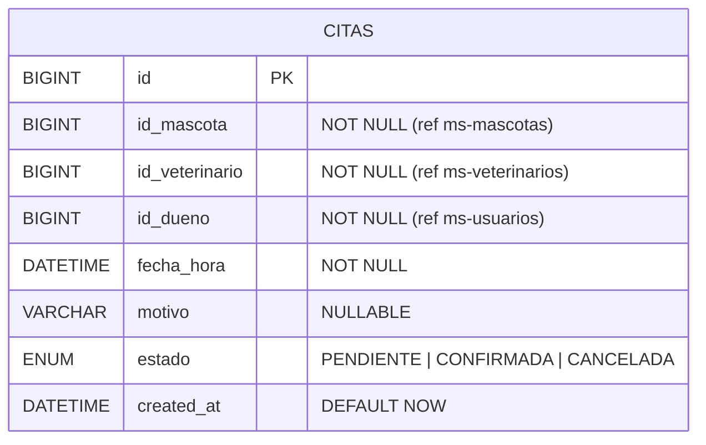
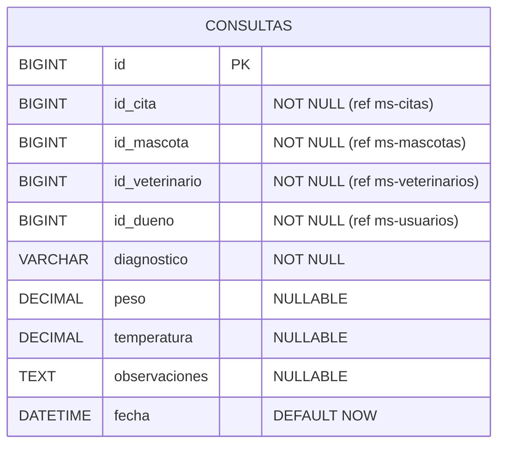
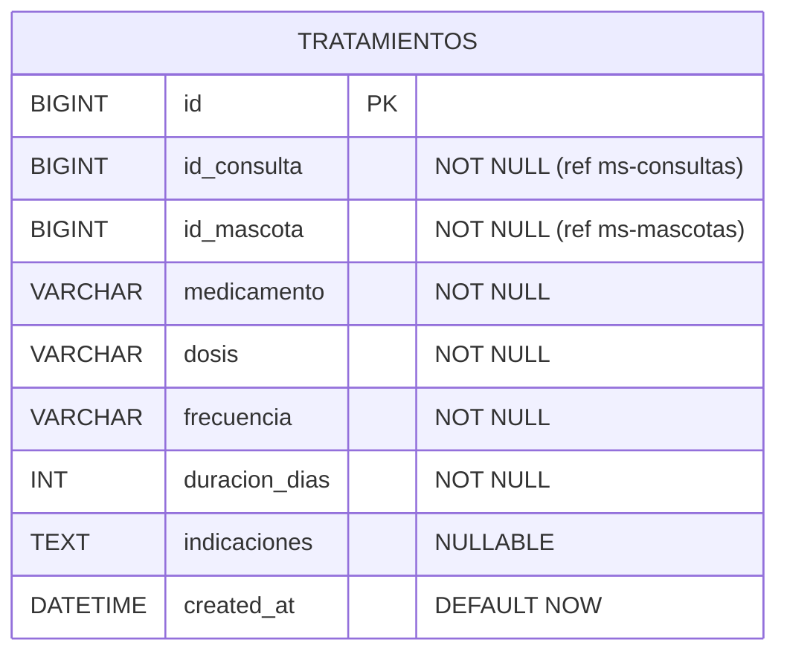
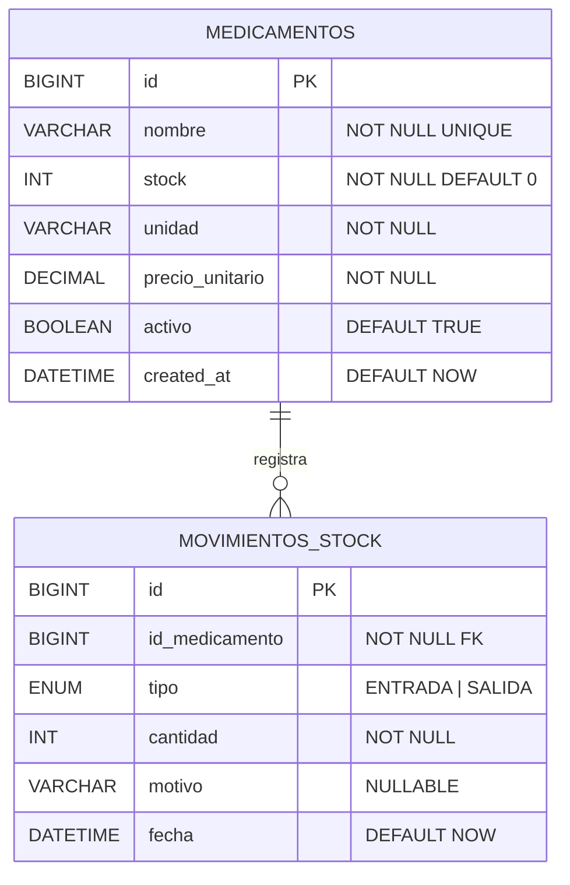
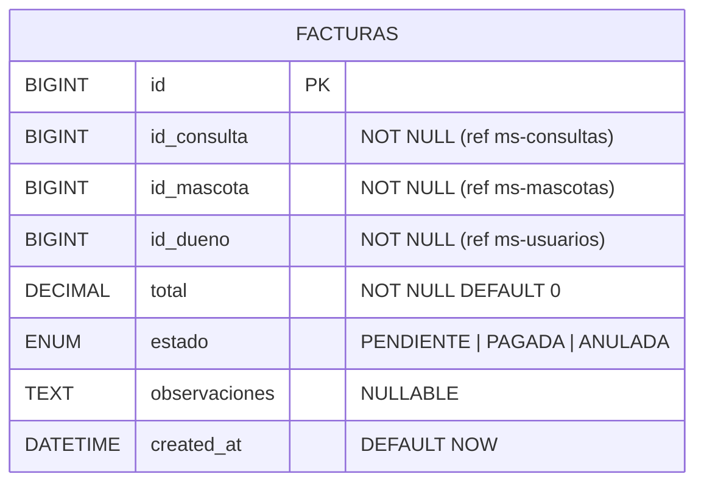
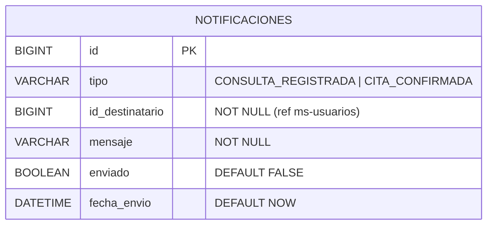

# Sistema de Gestión - Clínica Veterinaria

Proyecto Desarrollo FullStack I. Sistema de gestión veterinaria con arquitectura de microservicios.

## Stack tecnológico

- Java 21 / Spring Boot 4.0.6
- MySQL 8 (Docker)
- Apache Kafka (mensajería asíncrona)
- Eureka (Service Discovery)
- API Gateway
- OpenFeign (comunicación síncrona)
- JWT + Spring Security
- Flyway (migraciones SQL)
- Lombok

## Microservicios

| Servicio | Puerto | Descripción |
|---|--------|---|
| eureka-server | 9761   | Service Discovery |
| api-gateway | 9080   | Enrutamiento centralizado |
| ms-auth | 9081   | Autenticación JWT |
| ms-usuarios | 9082   | Gestión de dueños |
| ms-mascotas | 9083   | Gestión de mascotas e historial |
| ms-veterinarios | 9084   | Gestión de veterinarios y horarios |
| ms-citas | 9085   | Agendamiento de citas |
| ms-consultas | 9086   | Registro de consultas |
| ms-tratamientos | 9087   | Gestión de tratamientos |
| ms-inventario | 9088   | Control de stock de medicamentos |
| ms-facturacion | 9089   | Emisión de facturas |
| ms-notificaciones | 9090   | Notificaciones a dueños |

## Requisitos previos

- Docker Desktop instalado y corriendo
- Java 21
- IntelliJ IDEA
- Postman (para pruebas)

## Cómo levantar el proyecto

Todo el sistema (MySQL, Eureka, API Gateway, Kafka y los 10 microservicios) se levanta con un solo comando, usando Docker Compose.

**1. Ubicarse en la raíz del proyecto:**
```bash
cd clinica-veterinaria
```

**2. Levantar todo el sistema:**
```bash
docker-compose up --build
```

La primera vez puede tardar varios minutos mientras se construyen las 12 imágenes (Maven descarga dependencias y compila cada microservicio). Las siguientes veces es más rápido gracias al cache de Docker.

**3. Verificar que todo esté arriba (en otra terminal):**
```bash
docker ps -a
```

Todos los servicios deben mostrar estado `Up`, y `mysql-docker` debe mostrar `(healthy)`.

**4. Verificar Eureka:**
Abrir [http://localhost:9761](http://localhost:9761) — deben aparecer registrados: API-GATEWAY, MS-AUTH, MS-USUARIOS, MS-MASCOTAS, MS-VETERINARIOS, MS-CITAS, MS-CONSULTAS, MS-TRATAMIENTOS, MS-INVENTARIO, MS-FACTURACION, MS-NOTIFICACIONES.

**5. Documentación interactiva (Swagger) de cada microservicio:**

| Microservicio | Swagger UI |
|---|---|
| ms-auth | http://localhost:9081/swagger-ui.html |
| ms-usuarios | http://localhost:9082/swagger-ui.html |
| ms-mascotas | http://localhost:9083/swagger-ui.html |
| ms-veterinarios | http://localhost:9084/swagger-ui.html |
| ms-citas | http://localhost:9085/swagger-ui.html |
| ms-consultas | http://localhost:9086/swagger-ui.html |
| ms-tratamientos | http://localhost:9087/swagger-ui.html |
| ms-inventario | http://localhost:9088/swagger-ui.html |
| ms-facturacion | http://localhost:9089/swagger-ui.html |
| ms-notificaciones | http://localhost:9090/swagger-ui.html |

**6. Probar a través del API Gateway:**
Todas las peticiones deben ir a `http://localhost:9080`, por ejemplo:
```
GET  http://localhost:9080/usuarios
GET  http://localhost:9080/mascotas
POST http://localhost:9080/auth/login   (body: {"username":"admin","password":"admin123"})
```

**7. Detener el sistema:**
```bash
docker-compose down        # detiene los contenedores, conserva los datos
docker-compose down -v     # detiene y borra los datos (reinicio limpio)
```

### Notas sobre el entorno

- Si el puerto 3306 ya está en uso en tu máquina (por ejemplo, un MySQL instalado de forma nativa), `docker-compose.yml` ya expone el MySQL del proyecto en el puerto **3406** externamente — esto no afecta a los microservicios, que se conectan internamente por el nombre del contenedor (`mysql-local`) en el puerto 3306 de la red Docker.
- Las 10 bases de datos se crean automáticamente la primera vez que arranca `mysql-local`, mediante el script `mysql-init/01-create-databases.sql`.
- Si necesitas levantar un microservicio individual fuera de Docker (por ejemplo desde IntelliJ para depurar), recuerda detener su contenedor equivalente primero para evitar conflicto de puertos.

### Perfiles de Spring (dev / prod)

Cada microservicio tiene dos perfiles de configuración:
- **dev** (activo por defecto): usado en Docker Compose y en ejecución local desde IntelliJ.
- **prod**: usa variables de entorno (`DB_URL`, `DB_USERNAME`, `DB_PASSWORD`, etc.) para despliegues remotos (Railway, Render).

## Flujos principales

**Comunicación síncrona (Feign):**
- ms-citas → ms-veterinarios (verificar disponibilidad)
- ms-citas → ms-mascotas (verificar mascota del dueño)

**Comunicación asíncrona (Kafka):**
- ms-consultas publica `consulta.registrada`
- ms-tratamientos, ms-inventario, ms-facturacion y ms-notificaciones consumen `consulta.registrada`

## Roles

| Rol | Descripción |
|---|---|
| ADMIN | Acceso total al sistema |
| VETERINARIO | Consultas, tratamientos, citas |
| DUENO | Sus mascotas, citas y facturas |

## Diagramas Entidad-Relación (DER)

> Las relaciones entre microservicios son lógicas, no físicas, siguiendo el principio de base de datos independiente por microservicio.

### ms-auth


### ms-usuarios


### ms-mascotas


### ms-veterinarios


### ms-citas


### ms-consultas


### ms-tratamientos


### ms-inventario


### ms-facturacion


### ms-notificaciones

