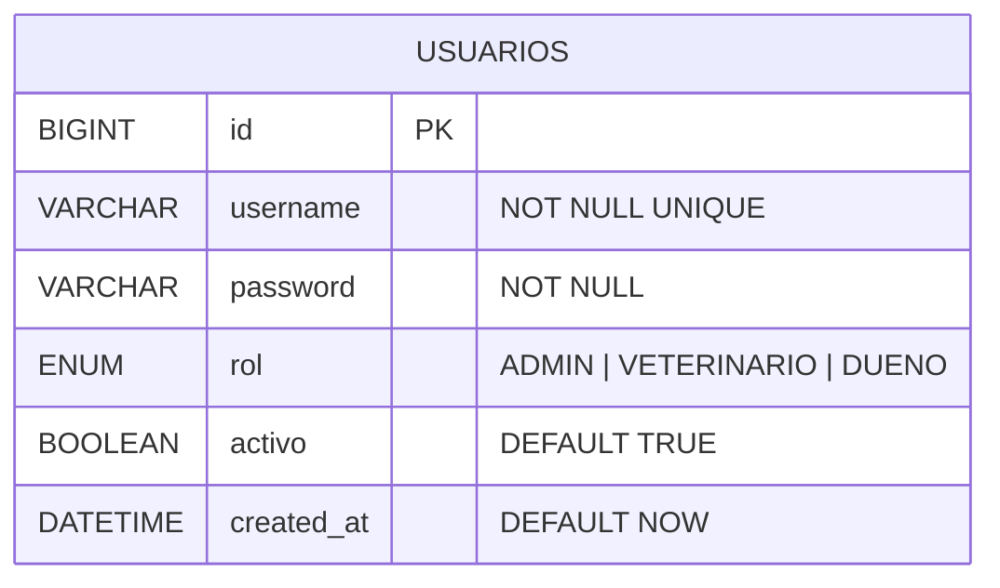
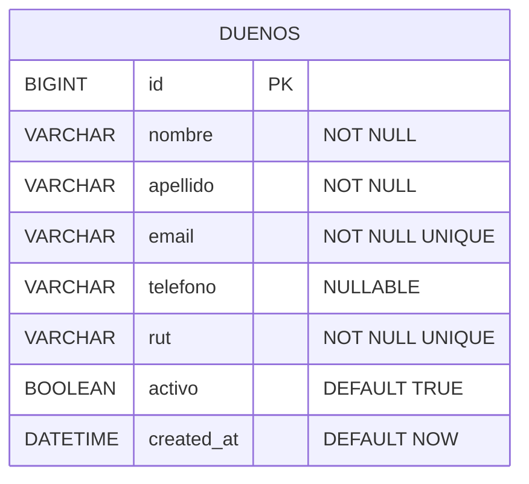
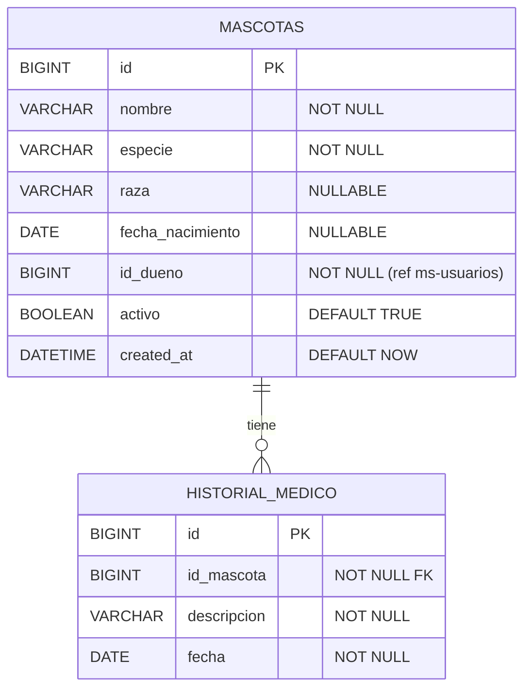
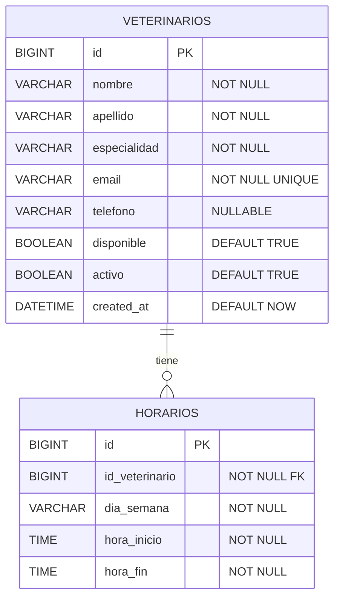
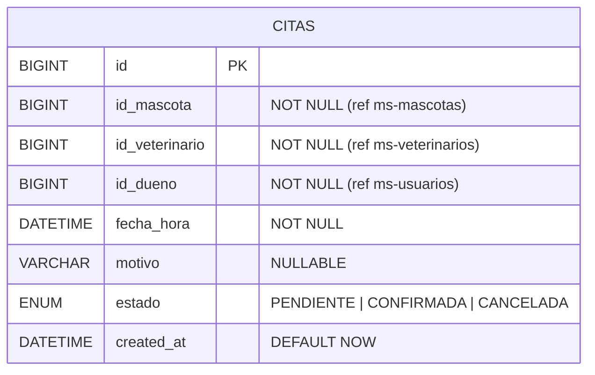
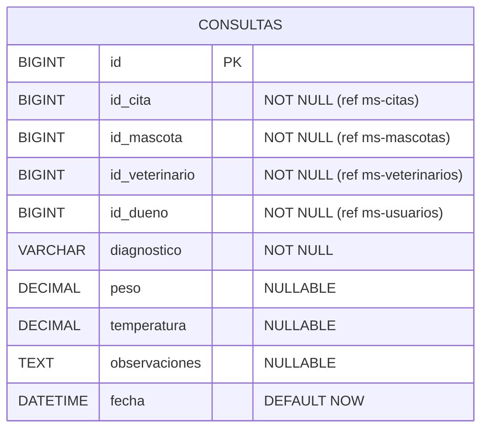
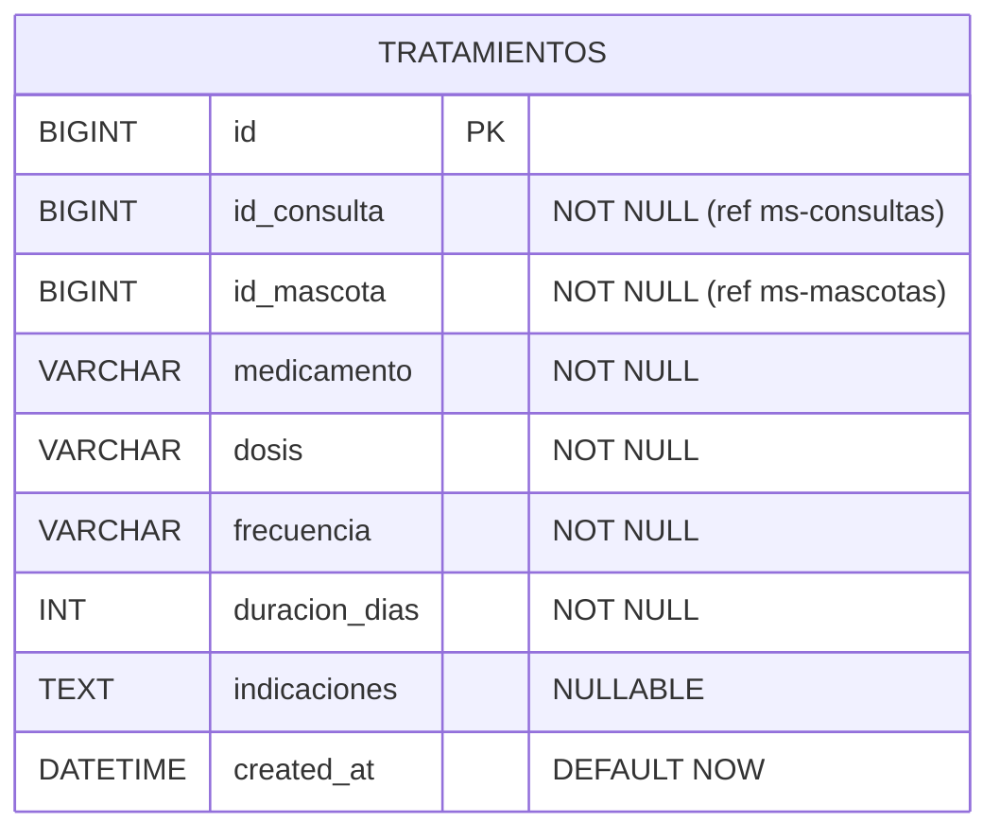
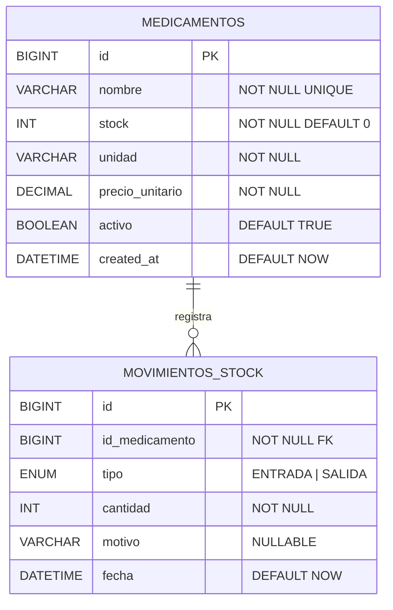
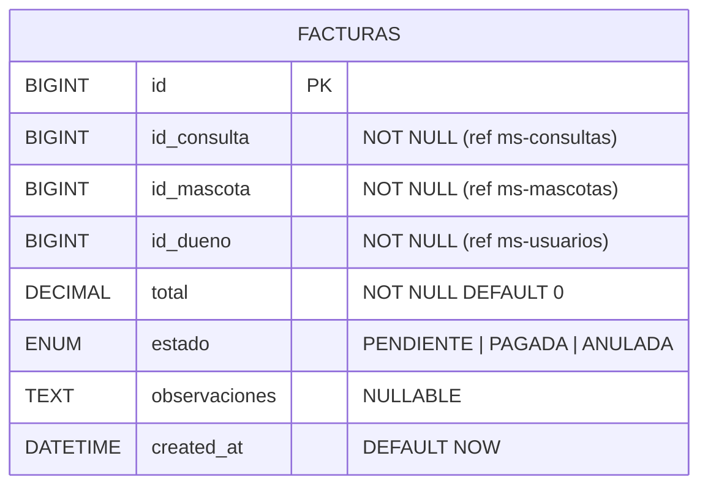
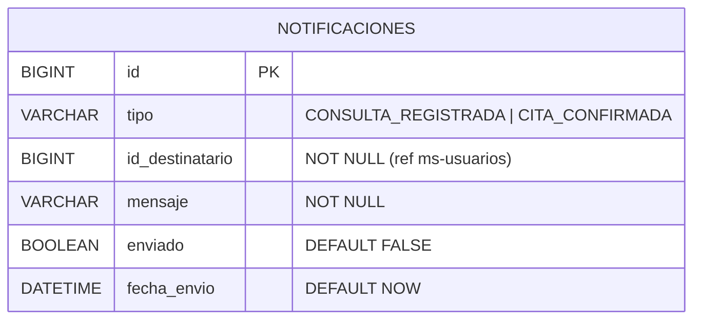

# Sistema de Gestión - Clínica Veterinaria

Proyecto Desarrollo FullStack I. Sistema de gestión veterinaria con arquitectura de microservicios.

## Stack tecnológico

- Java 21 / Spring Boot 4.0.6
- MySQL 8 (Docker)
- Apache Kafka (mensajería asíncrona)
- Eureka (Service Discovery)
- API Gateway
- OpenFeign (comunicación síncrona)
- JWT + Spring Security
- Flyway (migraciones SQL)
- Lombok

## Microservicios

| Servicio | Puerto | Descripción |
|---|---|---|
| eureka-server | 8761 | Service Discovery |
| api-gateway | 8080 | Enrutamiento centralizado |
| ms-auth | 8081 | Autenticación JWT |
| ms-usuarios | 8082 | Gestión de dueños |
| ms-mascotas | 8083 | Gestión de mascotas e historial |
| ms-veterinarios | 8084 | Gestión de veterinarios y horarios |
| ms-citas | 8085 | Agendamiento de citas |
| ms-consultas | 8086 | Registro de consultas |
| ms-tratamientos | 8087 | Gestión de tratamientos |
| ms-inventario | 8088 | Control de stock de medicamentos |
| ms-facturacion | 8089 | Emisión de facturas |
| ms-notificaciones | 8090 | Notificaciones a dueños |

## Requisitos previos

- Docker Desktop instalado y corriendo
- Java 21
- IntelliJ IDEA
- Postman (para pruebas)

## Cómo levantar el proyecto

**1. Levantar bases de datos y Kafka:**
```bash
docker-compose up -d
```

**2. Verificar contenedores:**
```bash
docker-compose ps
```

**3. Levantar microservicios en IntelliJ en este orden:**
1. eureka-server
2. api-gateway
3. ms-auth
4. Resto de microservicios en cualquier orden

**4. Verificar Eureka:**
Abrir http://localhost:8761 en el navegador.

## Flujos principales

**Comunicación síncrona (Feign):**
- ms-citas → ms-veterinarios (verificar disponibilidad)
- ms-citas → ms-mascotas (verificar mascota del dueño)

**Comunicación asíncrona (Kafka):**
- ms-consultas publica `consulta.registrada`
- ms-tratamientos, ms-inventario, ms-facturacion y ms-notificaciones consumen `consulta.registrada`

## Roles

| Rol | Descripción |
|---|---|
| ADMIN | Acceso total al sistema |
| VETERINARIO | Consultas, tratamientos, citas |
| DUENO | Sus mascotas, citas y facturas |

## Diagramas Entidad-Relación (DER)

> Las relaciones entre microservicios son lógicas, no físicas, siguiendo el principio de base de datos independiente por microservicio.

### ms-auth


### ms-usuarios


### ms-mascotas


### ms-veterinarios


### ms-citas


### ms-consultas


### ms-tratamientos


### ms-inventario


### ms-facturacion


### ms-notificaciones

